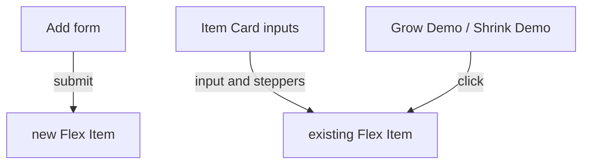

# Semantic markup for the Add form and Item Card inputs

Pickup doc for the visual-first markup pass. Domain words from [CONTEXT.md](../CONTEXT.md). Does **not** restyle, rename BEM classes, or touch NumberFlow. Apply in `index.html` first; `404.html` / `500.html` after that is settled. **Ship this pass before** [prd-numberflow.md](prd-numberflow.md): NumberFlow assumes labeled native inputs and only swaps read-only `data-field` hosts.

This is not one “control panel.” The product already has three jobs.



- **Add form** — a real `<form>`. Draft Grow / Shrink / Basis; Add commits a new Flex Item. Keep [`flexulator__form-container`](../index.html), `preventDefault` on submit, `type="submit"` on Add.
- **Item Card inputs** — live settings on an existing Flex Item. Not a `<form>`, not a `<fieldset>`. Wrapping `<label>` around each Grow / Shrink / Basis control so the visible word focuses the input. Keep `<section class="flex-item__form">` as a layout wrapper.
- **Grow Demo / Shrink Demo** — `type="button"`, outside the Add form. They only change Basis.

Do not wrap the calculator in one form. No unique legends, no visually-hidden utility, no `aria-label` on empty steppers, no accessibility-tree ship gate.

**Audience:** visual flex-layout teacher. Native tags that help sighted/keyboard use stay; AT-only chrome does not.

**Class names stay.** [ADR 0011](adr/0011-js-naming.md) and [css-layers-plan.md](css-layers-plan.md): this pass changes tags only. `.flexulator__form` / `.flex-item__form` are BEM, not glossary terms.

## Current problems in index.html

Add form:

- `label for="flex-grow"` but the input has only `name`, no matching `id`.
- Add sits in `<label for="">`, which is not a label.
- `h4` / `h5` inside labels are not headings. **Change them to `span`.** CSS already targets classes.
- Add is `type="button"` even though [`js/main.js`](../js/main.js) already listens for `submit`.

Item Card template:

- Inputs have no `<label>`; the visible “grow / shrink / flex-basis” text is an unassociated `h5`.
- Increment / decrement buttons have no accessible name. **Leave them unnamed** (visual-first).
- The cluster is a `<section class="flex-item__form">`. Keep the class; do not turn it into a form or fieldset.

## Markup to use

**Add form**

```html
<form class="flexulator__form-container" autocomplete="off">
  <label class="flexulator__form-label" for="new-item-grow">
    <span class="flexulator__form-header">grow:</span>
    <input id="new-item-grow" class="flexulator__form-input" name="flex-grow" type="number" min="0" value="1">
  </label>
  <!-- same for shrink and basis -->
  <button type="submit" class="flexulator__form-label-button flexulator__form-label-button-add-flex-item">
    <span class="flexulator__form-label-button-text">Add</span>
  </button>
</form>
```

`autocomplete="off"`: these are not personal-data fields. No fieldset: three labeled fields plus submit do not need one.

**Item Card** — wrapping `<label>` around the visible name and the `<input>` only, so cloned cards do not need unique `id`s. Increment / decrement stay **outside** the label: a label’s control is the first labelable descendant, so buttons inside would steal “grow” from the input. NumberFlow v1 never sits in this cluster; a later overlay still labels the input.

```html
<section class="flex-item__form">
  <div class="flex-item__form-label">
    <span class="flex-item__form-label-container">
      <button type="button" class="flex-item__grow-increment flex-item__form-button"></button>
      <label>
        <input type="number" class="flex-item__grow-value" name="grow" data-field="grow" min="0" value="1" autocomplete="off">
        <span class="flex-item__form-label-name">grow</span>
      </label>
      <button type="button" class="flex-item__grow-decrement flex-item__form-button"></button>
    </span>
  </div>
  <!-- shrink, flex-basis -->
</section>
```

**JS:** keep `submit` → Add; drop the extra click listener on the Add button once it is `type="submit"`. Item `input` / stepper handlers stay. Do not write legends in `syncItemCards`.

**Add form** is in [CONTEXT.md](../CONTEXT.md). This pass does not add AT-only chrome (no unique legends, no visually-hidden utility, no stepper `aria-label`).

## Reconcile with NumberFlow

NumberFlow is out of this pass ([PRD](prd-javascript-refactor.md), [css-layers-plan.md](css-layers-plan.md) parks `::part`). Markup must not make that work harder.

NumberFlow animates a displayed number on a **stable node**. Constraints already in the ADRs still apply:

| Constraint | Why NumberFlow cares |
| --- | --- |
| Patch Item Cards by id ([ADR 0002](adr/0002-reconcile-item-cards.md)) | Rebuilding innerHTML destroys the custom element and restarts the animation |
| Paint via `data-field` on the same nodes ([ADR 0012](adr/0012-data-field-paint.md)) | `paintFields` is the hook; NumberFlow should replace `textContent`/`value` writes, not a second paint path |
| Skip the focused input | Typing grow/shrink/basis must not fight an in-flight number animation |
| BEM classes stay; `data-field` stays on the control | Style vs paint stay split; NumberFlow `::part` can target the number without renaming classes |

Reconciled with [prd-numberflow.md](prd-numberflow.md) and [ADR 0015](adr/0015-numberflow-read-only.md):

- v1 NumberFlow replaces read-only `data-field` hosts (Measured Width, formulas, teaching panels). Native inputs stay native.
- The wrapping `<label>` contains only the name and the `<input>`. Steppers stay outside. A parked overlay still paints/labels that same input; do not put `<number-flow>` inside the label in v1.
- `<number-flow-group>` wraps Measured Width plus the formula block (and teaching-panel values). It does **not** wrap `.flex-item__form` or Remove.
- Measured Width is not a heading: `<number-flow>` plus a `<span>` caption. Fake headings in the Add form / Item Card labels are `<span>`s (this pass). Formula-section `h5`s stay out of both passes until a heading-outline pass.
- NumberFlow hosts stay readable like today’s spans: no `aria-live`, no `aria-hidden`, no spoken summary. Labeled inputs remain the editable controls.
- `::part` styling stays with the CSS layers plan.

Safe for NumberFlow if this markup ships as specified: the labeled control is the `<input data-field>`; formula `data-field` spans are untouched by this pass; Item Card identity is unchanged.

If NumberFlow later overlays an input, keep `data-field` on the node `paintFields` writes (the input). Do not introduce a second selector vocabulary.

## Out of scope this pass

- `404.html` and `500.html` until `index.html` is settled
- Formula tabs, heading outline elsewhere, class renames, restyling
- NumberFlow (next pass — see [prd-numberflow.md](prd-numberflow.md)), stepper UX, focus rings
- Fieldset / unique legend / stepper `aria-label` (rejected: visual-first)
